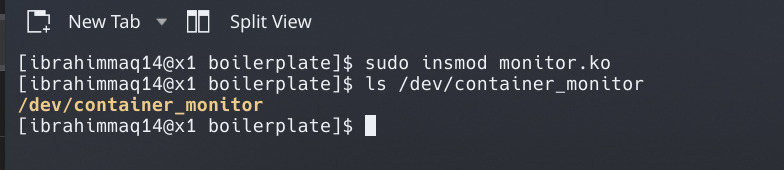
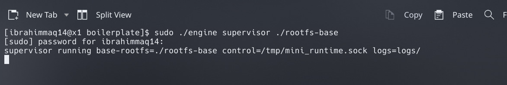
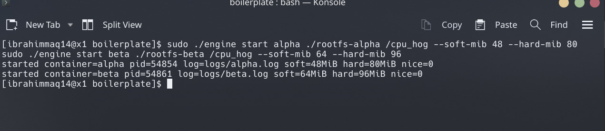
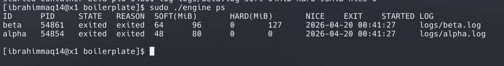
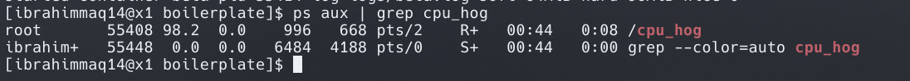
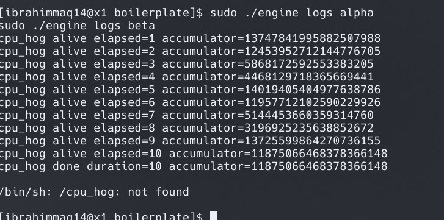
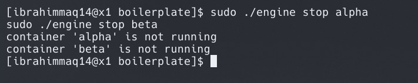

# Kernel Container Runtime OS (OS Jackfruit)

## 📌 Overview

This project implements a lightweight Linux container runtime in C  
with:  
- A supervisor (`engine`)  
- A kernel module (`monitor.ko`)  
- Multi-container support, logging, and memory limits  
- IPC-based CLI communication  
- Scheduler experimentation using nice values  

------------------------------------------------------------------------

## ⚙️ System Requirements

- Linux (Arch / Ubuntu)  
- GCC, Make  
- Kernel headers installed  

Check:

    uname -r

------------------------------------------------------------------------

## 🔧 Build Instructions

    cd boilerplate
    make

------------------------------------------------------------------------

## 🚀 Run Instructions

### 1. Load Kernel Module

    sudo insmod monitor.ko
    ls /dev/container_monitor

------------------------------------------------------------------------

### 2. Start Supervisor (Terminal 1)

    sudo ./engine supervisor ./rootfs-base

------------------------------------------------------------------------

### 3. Start Containers (Terminal 2)

    sudo ./engine start alpha ./rootfs-alpha /cpu_hog --soft-mib 48 --hard-mib 80
    sudo ./engine start beta ./rootfs-beta /cpu_hog --soft-mib 64 --hard-mib 96

------------------------------------------------------------------------

### 4. Check Containers

    sudo ./engine ps

------------------------------------------------------------------------

### 5. Verify CPU Hog Running

    ps aux | grep cpu_hog

------------------------------------------------------------------------

### 6. View Logs

    sudo ./engine logs alpha
    sudo ./engine logs beta

------------------------------------------------------------------------

### 7. Stop Containers

    sudo ./engine stop alpha
    sudo ./engine stop beta

------------------------------------------------------------------------

## 🔗 IPC & CLI Demonstration (Task 2)

The CLI communicates with the supervisor using a UNIX domain socket.

### Run CLI commands

    sudo ./engine start ipc1 ./rootfs-alpha "/cpu_hog 30"
    sudo ./engine start ipc2 ./rootfs-beta "/cpu_hog 30"

### List containers

    sudo ./engine ps

### View logs

    sudo ./engine logs ipc1
    sudo ./engine logs ipc2

### Run foreground container

    sudo ./engine run ipc3 ./rootfs-alpha /cpu_hog

### Stop containers

    sudo ./engine stop ipc1
    sudo ./engine stop ipc2

### Verify IPC socket

    ls /tmp/mini_runtime.sock

------------------------------------------------------------------------

## ⚡ Scheduler Experiment (Task 5)

### Run containers with different priorities

    sudo ./engine start high ./rootfs-alpha "/cpu_hog 30" --nice -10
    sudo ./engine start low ./rootfs-beta "/cpu_hog 30" --nice 10

### Check container status

    sudo ./engine ps

### Compare logs

    sudo ./engine logs high
    sudo ./engine logs low

### Stronger experiment (CPU contention)

    sudo ./engine start high2 ./rootfs-alpha "/cpu_hog 30" --nice -10
    sudo ./engine start low1 ./rootfs-beta "/cpu_hog 30" --nice 10
    sudo ./engine start low2 ./rootfs-beta "/cpu_hog 30" --nice 10

### Stop all scheduler containers

    sudo ./engine stop high
    sudo ./engine stop low
    sudo ./engine stop high2
    sudo ./engine stop low1
    sudo ./engine stop low2

------------------------------------------------------------------------

## 📸 Screenshots

### Screenshot 1: Kernel Module Loaded

### Screenshot 2: Supervisor Running

### Screenshot 3: Containers Started

### Screenshot 4: Engine Status

### Screenshot 5: CPU Hog Running

### Screenshot 6: Logs Output

### Screenshot 7: Containers Stopped

------------------------------------------------------------------------

## 📊 Observations

- Kernel module creates `/dev/container_monitor`  
- Containers run with memory limits  
- CPU workload executes inside container  
- Logs are generated correctly  
- IPC works via UNIX domain socket  
- Scheduler behavior varies with nice values  

------------------------------------------------------------------------

## ⚠️ Notes

If you see:

    /bin/sh: /cpu_hog: not found

It means the binary is missing in that container rootfs.

------------------------------------------------------------------------

## 📁 Project Structure

    boilerplate/
    ├── engine
    ├── monitor.ko
    ├── rootfs-alpha/
    ├── rootfs-beta/
    ├── logs/

------------------------------------------------------------------------

## ✅ Conclusion

This project demonstrates:  
- Container creation using namespaces  
- Supervisor-based container management  
- Kernel-level monitoring  
- Logging and process tracking  
- IPC between CLI and supervisor  
- Scheduler behavior using priority control  

------------------------------------------------------------------------

## 👨‍💻 Author

- Ibrahim Maqsood  
